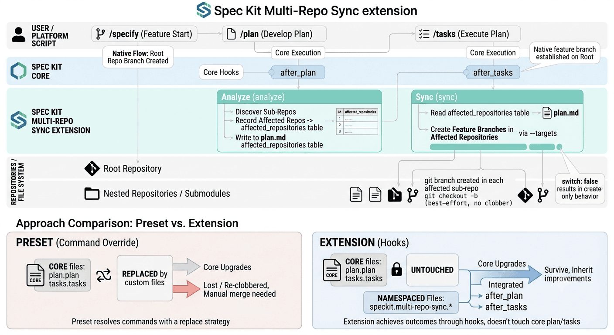

# spec-kit-multi-repo-sync

> Spec Kit extension that propagates feature branches across multiple repos and
> git submodules via plan/tasks hooks — **without overriding core commands**.

When you start a feature in a multi-module project, Spec Kit creates a feature
branch in the **root** repository only. If your sub-components keep independent
git histories (nested repos under a shared root) or are wired as **git
submodules**, you then have to create the matching branch in each one by hand.

This extension does it for you — automatically, on the native lifecycle hooks,
and idempotently.

---

## Why an extension and not the preset?

A community **preset** already solves the functional problem:
[`sakitA/spec-kit-preset-multi-repo-branching`](https://github.com/sakitA/spec-kit-preset-multi-repo-branching).
Its detection logic is sound and this extension deliberately **reuses it** and
stays **config-compatible** with it.

The problem is *how* a preset delivers it. Presets resolve commands with a
**replace** strategy: the preset's `plan` / `tasks` command file fully replaces
the core one at install time. So every time Spec Kit core improves
`speckit.plan` or `speckit.tasks`, running `specify self upgrade` either reverts the
customization or re-overwrites the new core version — you lose native
improvements and face a manual merge on **every** upgrade. Command composition
(append/prepend/wrap) does not yet exist for commands in core.

**This extension achieves the same outcome through Spec Kit _hooks_ instead.**

| | Preset (command override) | This extension (hooks) |
|---|---|---|
| Touches core `plan`/`tasks` files | **Yes** (replaces them) | **No** |
| Survives `specify self upgrade` | Manual merge each time | **Yes**, untouched |
| Inherits core improvements to plan/tasks | Lost / re-clobbered | **Yes**, automatically |
| Lives in its own namespaced files | No | **Yes** (`speckit.multi-repo-sync.*`) |

The fan-out logic runs **alongside** the native commands via the `after_plan`
and `after_tasks` hook events. Core upgrades never touch this extension's files,
and this extension never touches core's.

---

## How it works



This mirrors the [`spec-kit-preset-multi-repo-branching`][preset] flow (discover
in *plan*, branch in *tasks*), but as a **hook-based extension** that survives
`specify self upgrade` instead of overriding the core `plan`/`tasks` commands.

1. You run the normal flow: `/speckit.specify` → `/speckit.plan` →
   `/speckit.tasks`. The native flow establishes the feature branch on the root.
2. On `after_plan`, Spec Kit invokes this extension's
   `speckit.multi-repo-sync.analyze` command. It discovers the candidate
   sub-repositories / submodules and records the ones the feature **affects** in
   an **Affected Repositories** table inside `plan.md`.
3. On `after_tasks`, Spec Kit invokes `speckit.multi-repo-sync.sync`. It reads
   that table and creates the matching feature branch in each affected repository
   (passing them to the sync script via `--targets`). If no table is present it
   falls back to branching every detected sub-repository.

Branch creation mirrors the preset's `git checkout -b`: the branch is created and
the sub-repo is **switched** onto it by default (best-effort — on a dirty working
tree the branch is still created but not switched, so nothing is clobbered). Set
`switch: false` to get create-only behavior. Uninitialized submodules are
`git submodule update --init`-ed before branching, exactly like the preset.

[preset]: https://github.com/sakitA/spec-kit-preset-multi-repo-branching

---

## Install

> Requires Spec Kit (`specify`) and `git`. See [Compatibility](#compatibility).

**From a release archive (pin a version):**

```bash
specify extension add --from https://github.com/fyloss/spec-kit-multi-repo-sync/releases/download/v1.0.0/spec-kit-multi-repo-sync.zip
```

**From a local checkout (development):**

```bash
git clone https://github.com/fyloss/spec-kit-multi-repo-sync
specify extension add --from ./spec-kit-multi-repo-sync
```

After install, the extension lives entirely under
`.specify/extensions/multi-repo-sync/` and registers three namespaced commands in
your agent's command directory (e.g. `.claude/commands/`). Its hooks are
recorded in `.specify/extensions.yml`.

### Verify the install

```bash
specify extension list          # multi-repo-sync should appear, enabled
/speckit.multi-repo-sync.status # reports detected targets + per-target state
```

You can also confirm core files are untouched: your `speckit.plan` /
`speckit.tasks` command files are the stock versions — this extension adds only
`speckit.multi-repo-sync.*`.

---

## Configuration

Configuration is read with this precedence (highest wins):

1. **Extension-local override** — `.specify/extensions/multi-repo-sync/multi-repo-sync-config.yml`
2. **Preset-compatible key** — `.specify/init-options.json` → `multi_repo_branching`
3. **Built-in defaults** — `{ "type": "auto", "scan_depth": 2 }`

Most users only need (2). Example `.specify/init-options.json`:

```json
{
  "multi_repo_branching": {
    "type": "auto",
    "scan_depth": 2,
    "switch": false,
    "skip_branches": ["main", "master"],
    "exclude": ["vendor", "third_party"]
  }
}
```

| Key | Default | Meaning |
|---|---|---|
| `type` | `auto` | `auto` \| `independent` \| `submodule` (see modes below) |
| `scan_depth` | `2` | Max directory depth when scanning for nested repos (independent mode) |
| `switch` | `true` | Also check out the branch in each sub-repo, mirroring `git checkout -b` (best-effort; on a dirty tree the branch is created but not switched). Set `false` for create-only. |
| `skip_branches` | `["main","master"]` | Never fan these out |
| `exclude` | `[]` | Extra path fragments to skip in independent mode (`.gitignore` is always respected) |

> `type`, `scan_depth` are the keys the preset already uses, so existing preset
> configs work unchanged. `switch`, `skip_branches`, `exclude` are this
> extension's additive options.

### Detection modes

- **`submodule`** — parse `.gitmodules` for submodule paths. No filesystem scan.
- **`independent`** — scan up to `scan_depth` directory levels for directories
  containing a `.git` entry (excluding the root), skipping anything matched by
  `git check-ignore` or `exclude`.
- **`auto`** *(default)* — use `submodule` if `.gitmodules` exists, else
  `independent`.

---

## Commands

| Command | Effect | Description |
|---|---|---|
| `/speckit.multi-repo-sync.analyze` | read-write (`plan.md`) | Discover sub-repositories and record the ones the feature affects in `plan.md`'s **Affected Repositories** table. Runs on `after_plan`. |
| `/speckit.multi-repo-sync.sync` | read-write | Create the current feature branch in the affected sub-repositories from that table (or every detected target if no table). Idempotent. Runs on `after_tasks`. |
| `/speckit.multi-repo-sync.status` | read-only | Report detected targets and the per-target state of the current branch. |

`sync` accepts optional flags (the command passes them to the platform script):

- `--dry-run` — show what would happen, create nothing.
- `--no-switch` — create the branch but do not switch onto it (switching is the
  default; see [`switch`](#configuration)).
- `--targets <csv>` — restrict to a comma-separated list of affected sub-repo
  paths (the `sync` command fills this in from the Affected Repositories table).
- `--branch <name>` — operate on a specific branch instead of the current one.
- `--verbose` / `--quiet` — logging level.

You rarely call `analyze`/`sync` manually — the hooks run them for you. `status`
and `sync --dry-run` are the handy day-to-day commands.

---

## Examples

See [`examples/`](./examples) for ready-to-copy configs and two annotated
repository layouts (independent nested repos and submodules).

---

## Troubleshooting

**The hooks don't seem to fire.**
Spec Kit wired the `after_tasks` / `after_implement` hook events into the command
templates before the earlier-stage `after_specify` / `after_plan` events. On
older cores, `after_plan` may not be wired even though `after_tasks` is. If
`after_plan` is silent on your version, the `analyze` step won't record an
Affected Repositories table — but the `after_tasks` `sync` step still runs and
falls back to branching every detected sub-repository (or run `/speckit.multi-repo-sync.analyze`
then `/speckit.multi-repo-sync.sync` manually). Upgrade core to get reliable
`after_plan` wiring. (See `requires.speckit_version` in `extension.yml`.)

**A sub-repo was reported as `failed`.**
Failures are isolated — they never abort your `plan`/`tasks` run. Common causes:
- *unborn HEAD* — the sub-repo has no commits yet; make an initial commit.
- *submodule init failed* — registered submodules are `git submodule update --init`-ed
  automatically; this means that clone failed (no network / bad URL).
- *not a git repository* — an independent target path isn't a git working tree.
Re-run `/speckit.multi-repo-sync.status` to inspect, fix the cause, then
`/speckit.multi-repo-sync.sync`.

**A sub-repo got the branch but stayed on its old branch.**
That's the default `switch: true` meeting a dirty working tree: the branch is
created but not checked out (we never stash or discard your changes). Commit/stash
in that sub-repo and switch manually, or set `switch: false` (or pass
`--no-switch`) for create-only behavior.

**It created branches I didn't want (e.g. in a vendored dependency).**
Add the path to `exclude`, or rely on `.gitignore` (already respected), or lower
`scan_depth`.

**Nothing happens on `main`.**
By design — `skip_branches` (default `main master`) prevents fanning out base
branches.

---

## Migrating from the preset

Coming from `spec-kit-preset-multi-repo-branching`:

1. Remove the preset's command overrides (or reinstall core `plan`/`tasks` so
   you're back on stock commands): `specify self upgrade` will now keep them current.
2. Install this extension (see [Install](#install)).
3. **Keep your existing config** — the `multi_repo_branching` block in
   `.specify/init-options.json` is read as-is. `type` and `scan_depth` behave
   identically.
4. Verify with `/speckit.multi-repo-sync.status`.

You lose nothing functionally and gain upgrade-safety.

---

## Compatibility

- **Spec Kit:** `>=0.2.0` (hook execution). Reliable `after_plan` firing depends
  on the version where the `speckit.plan` template hook wiring landed; newer is
  better. `after_tasks` has been wired the longest.
- **OS:** macOS, Linux (Bash) and Windows (PowerShell) — both shipped, behaviour
  equivalent.
- **Tools:** `git` is required. `python3` or `jq` improve `init-options.json`
  parsing in Bash; a grep/sed fallback handles the common flat keys without them.

---

## Testing

Self-contained harnesses build throwaway repos and assert every scenario
(independent, submodule, auto, scan_depth, branch-already-exists, dry-run,
dirty-tree/unborn failure isolation, skip-branch guard, read-only status):

```bash
bash tests/test-bash.sh
pwsh -NoProfile -File tests/test-powershell.ps1
```

---

## Design notes & assumptions

- Spec Kit's extension manifest schema has **no `category` / `effect` fields**
  (those belong to presets). The equivalent intent — a *process* extension with
  a *read-write* effect — is expressed via `tags` in `extension.yml` and the
  command table above.
- The extension hooks `after_plan` (discover + record affected repos) and
  `after_tasks` (create the branches), mirroring the preset's plan-then-tasks
  flow. The sync is idempotent, so re-runs are safe.
- Branches are created and (by default) switched to, mirroring `git checkout -b`;
  on a dirty sub-repo the branch is still created but not switched, so the working
  tree is never clobbered. Set `switch: false` for create-only.

## License

[MIT](./LICENSE)
